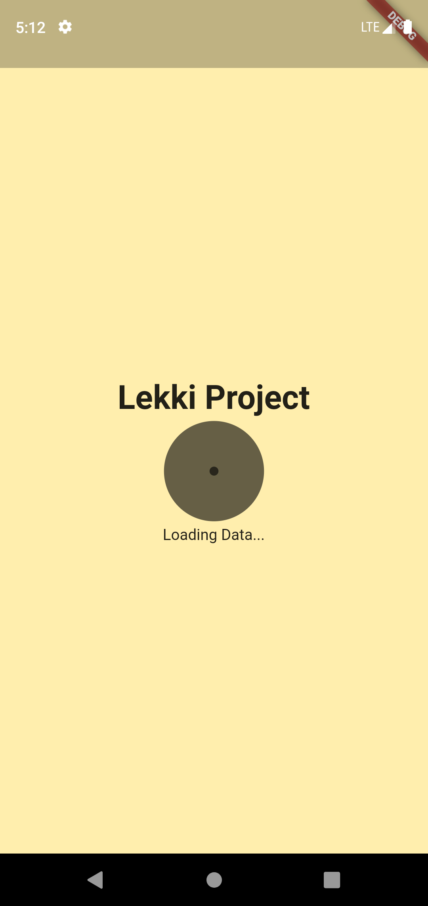
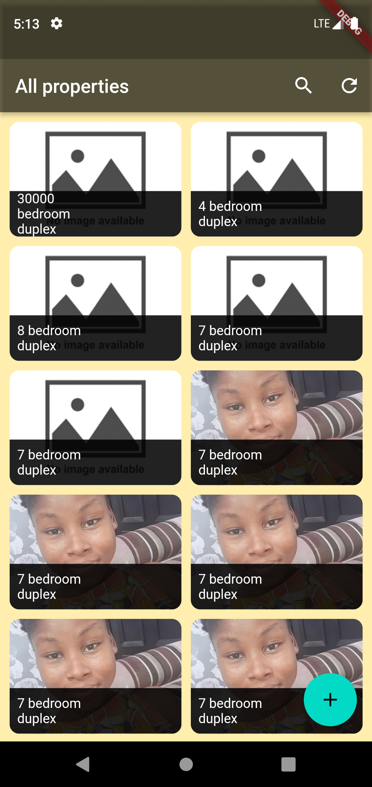
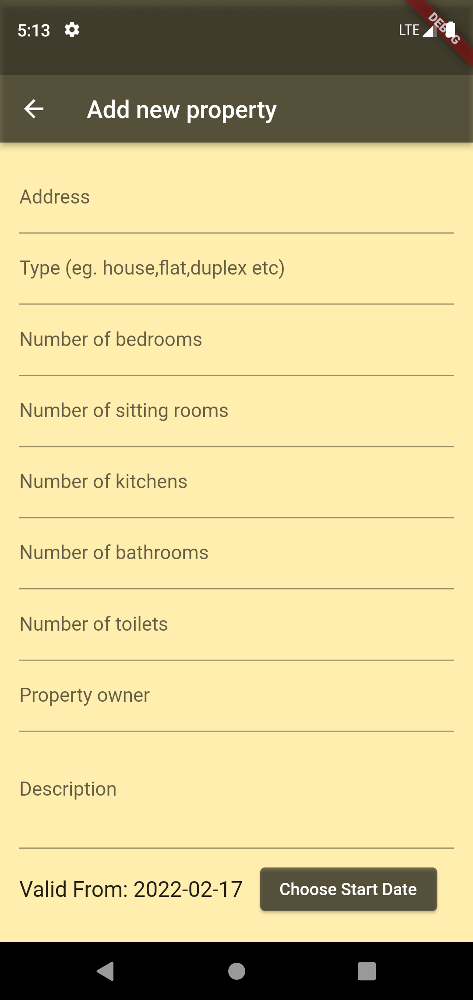
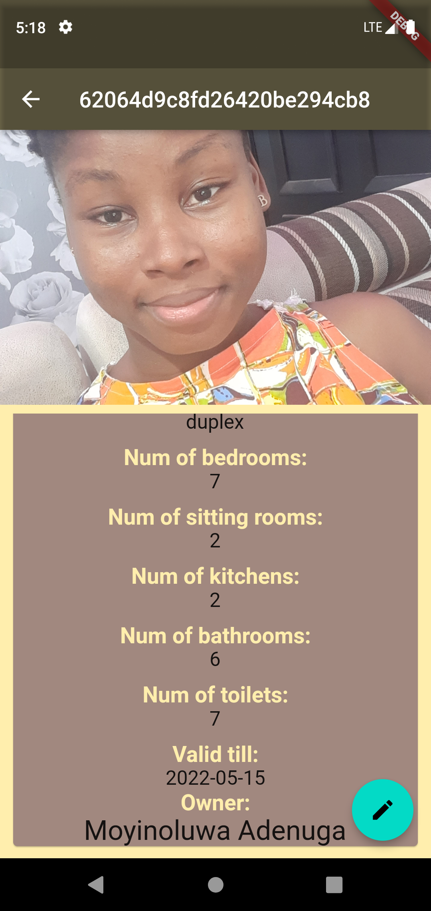
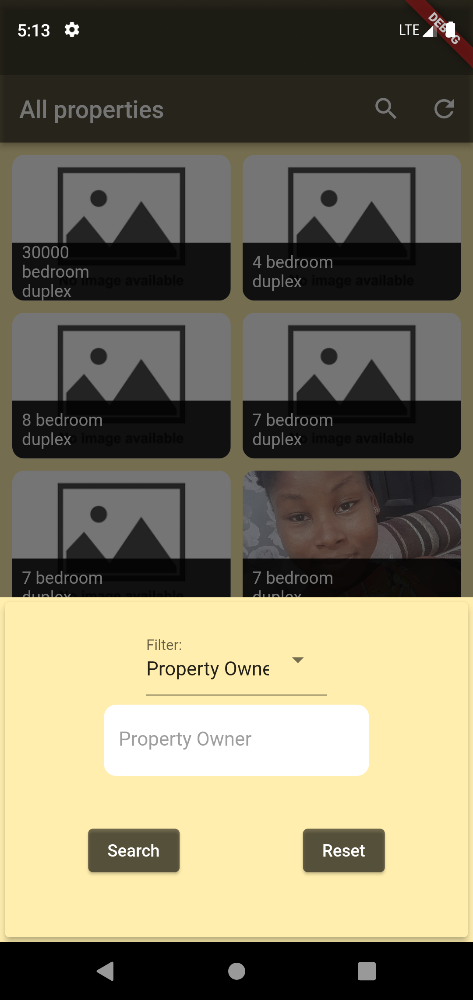
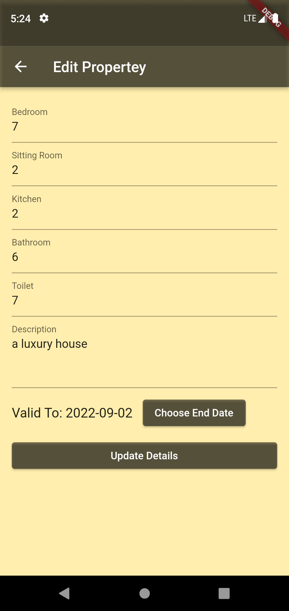

# lekki_project

A new Flutter project.

## Getting Started

A simple CRUD application to add property details.
BAckend used is Node.JS, Express.
Data collections made with http.

## Screenshots below:

